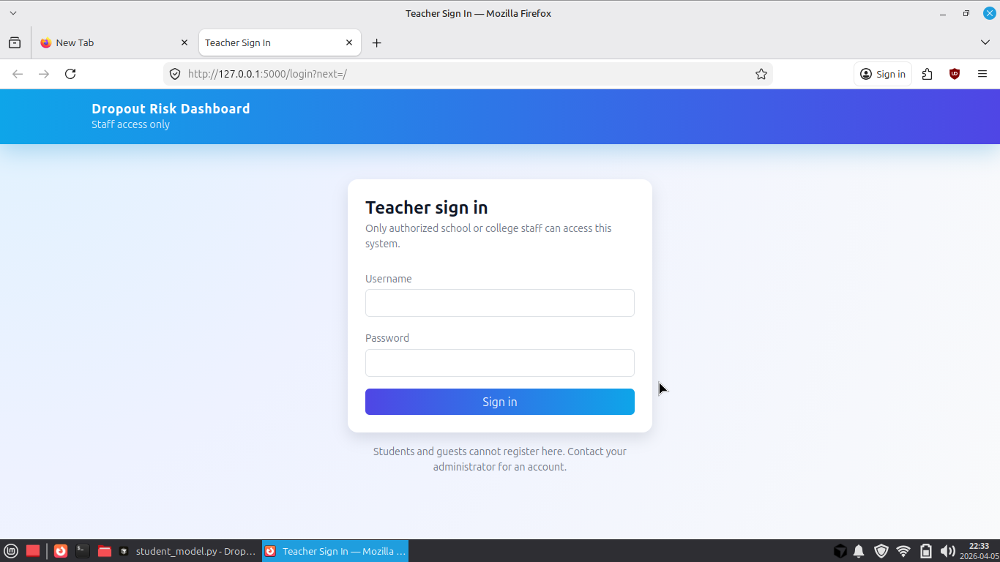
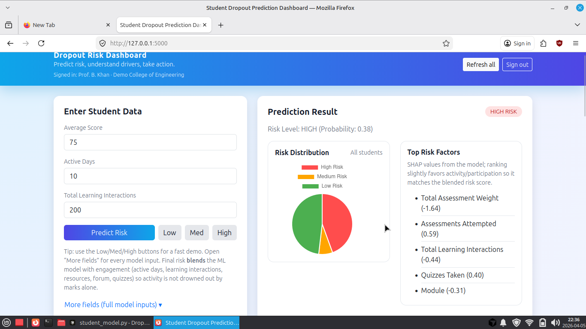
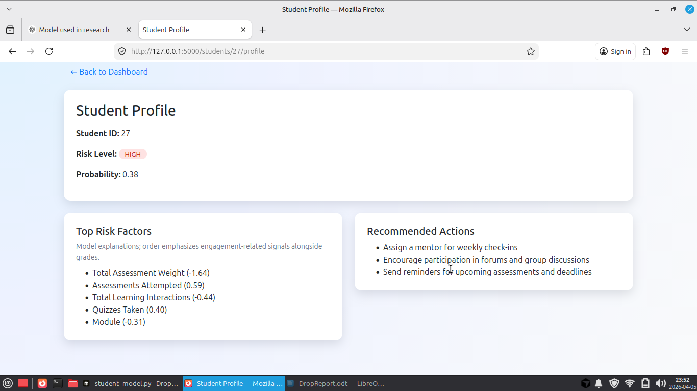

# Student Dropout Risk Dashboard

A web application for **predicting student dropout risk** using a trained **LightGBM** model, with **SHAP-based explanations**, **SQLite** storage for predictions, and **teacher-only access** via login. Built with **Flask**, **Bootstrap**, and **Chart.js** for coursework / demo / portfolio use.

---

## Features

- **Teacher authentication** — Session-based login; only users in the `teachers` table can access the app. Public registration is not enabled.
- **Risk prediction** — Submit student features (average score, active days, learning interactions, and optional “full model” fields). Response includes dropout probability, **LOW / MEDIUM / HIGH** risk band, and **top contributing factors** (SHAP).
- **Engagement blend** — Final probability combines the ML model with a simple **engagement heuristic** (activity, interactions, forum, quizzes) so risk is not driven by grades alone.
- **Persistence** — Each call to `/explain` saves a row in the database for history, analytics, and profiles.
- **Dashboard** — Risk distribution chart, recent predictions, high-risk list, paginated “all students.”
- **Student profile** — Per-student page with factors (friendly labels) and **recommended actions** by risk level.

---

## Tech stack

| Layer | Technology |
|--------|----------------|
| Backend | Python 3, Flask |
| ORM / DB | Flask-SQLAlchemy, SQLite (`database/database.db`) |
| ML | LightGBM (`.pkl`), joblib, pandas |
| Explainability | SHAP (TreeExplainer) |
| Auth | Flask sessions, Werkzeug password hashing |
| Frontend | Jinja2 templates, Bootstrap 5, Chart.js |

---

## Repository layout

```
DropOut/
├── app.py                 # Flask app, SECRET_KEY, auth guard
├── extensions.py          # SQLAlchemy db instance
├── requirements.txt
├── model/
│   └── lightgbm_dropout_model.pkl
├── database/
│   └── database.db        # Created/updated at runtime (gitignore recommended)
├── models/
│   ├── student_model.py
│   └── teacher_model.py
├── routes/
│   ├── auth_routes.py     # /login, /logout
│   ├── predict_routes.py  # /predict, /explain
│   └── student_routes.py  # /students, /analytics, /high-risk, profiles
├── services/
│   └── prediction_service.py  # Model load, predict, SHAP, blend
├── templates/
│   ├── index.html
│   ├── login.html
│   └── student_profile.html
├── static/
│   └── styles.css
├── seed_teachers.py       # Demo teacher accounts
└── seed_students.py       # Optional demo student rows
```

---

## Prerequisites

- Python **3.10+** (3.12 tested)
- The trained model file: `model/lightgbm_dropout_model.pkl` (included in this repo if you ship it; otherwise train/export your own with the **same `feature_columns` order** as in `services/prediction_service.py`)

---

## Quick start

### 1. Clone and virtual environment

```bash
git clone <your-repo-url>
cd DropOut
python -m venv venv
source venv/bin/activate          # Windows: venv\Scripts\activate
pip install -r requirements.txt
```

### 2. Environment (recommended for production)

```bash
export FLASK_SECRET_KEY="a-long-random-string"   # Linux / macOS
# Windows (cmd): set FLASK_SECRET_KEY=your-secret
```

If unset, a **development default** is used (change before any real deployment).

Optional for evaluation/demo access without sharing credentials:

```bash
export ENABLE_GUEST_LOGIN=true
```

When enabled, the login page shows **Continue as Guest (Demo)**.

### 3. Create login users

For local demo/testing:

```bash
python seed_teachers.py
```

For production (recommended), create accounts manually and do not use demo seeds:

```bash
python create_teacher.py --username your_admin --password 'ChangeThisNow123!' --name 'Admin User' --school 'Your School'
```

Local demo logins:

| Username   | Password     |
|-----------|--------------|
| `teacher1` | `teacher123` |
| `teacher2` | `teacher456` |

### 4. Optional: seed sample students

```bash
python seed_students.py
```

### 5. Run the app

```bash
python app.py
```

Open **http://127.0.0.1:5000** — you will be redirected to **`/login`**. After signing in, use the dashboard.

---

## Main HTTP routes

| Method | Path | Description |
|--------|------|-------------|
| GET | `/` | Dashboard (requires login) |
| GET/POST | `/login` | Teacher sign-in |
| POST/GET | `/logout` | End session |
| POST | `/explain` | Predict + SHAP + save `Student` (JSON) |
| POST | `/predict` | Predict only (JSON) |
| GET | `/students` | List students (summary JSON) |
| GET | `/students/<id>` | One student (JSON) |
| GET | `/students/<id>/profile` | HTML profile |
| GET | `/high-risk` | High-risk students (JSON) |
| GET | `/analytics` | Counts by risk band (JSON) |

Unauthenticated JSON endpoints return **`401`** with `{"error": "Authentication required"}`; HTML routes redirect to **`/login`**.

---

## Input features

The model expects the fields listed in **`feature_columns`** inside `services/prediction_service.py` (module codes, demographics, engagement, scores, assessment counts, etc.). The UI exposes a **short form** plus an expandable **“More fields”** section for the full vector.

---

## Security notes (for reports / deployment)

- **Staff identity** is “whoever has a `Teacher` row”; there is no automatic link to a real school directory.
- Use a strong **`FLASK_SECRET_KEY`**, HTTPS in production, and **replace demo passwords**.
- Do **not** run `seed_teachers.py` on production unless you intentionally set `ALLOW_DEMO_SEED=true`.
- Do **not** commit production databases or secrets; add `database/*.db`, `venv/`, and `.env` to **`.gitignore`** if applicable.

---

## Author

Final-year / coursework project — update this section with your name, institution, and license if you add one (e.g. MIT).

---

## Acknowledgements

- Model training pipeline and dataset are your own / institutional; cite the **Open University Learning Analytics** (OULAD) or equivalent if your features align with that design.

---

## 📸 User Interface

### 🔐 Login Page


### 📊 Dashboard


### 👤 Student Profile

